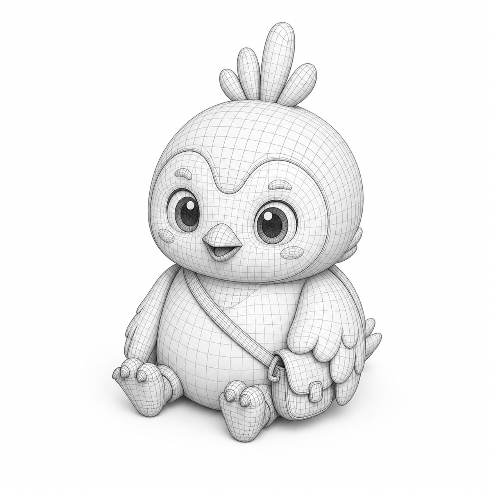
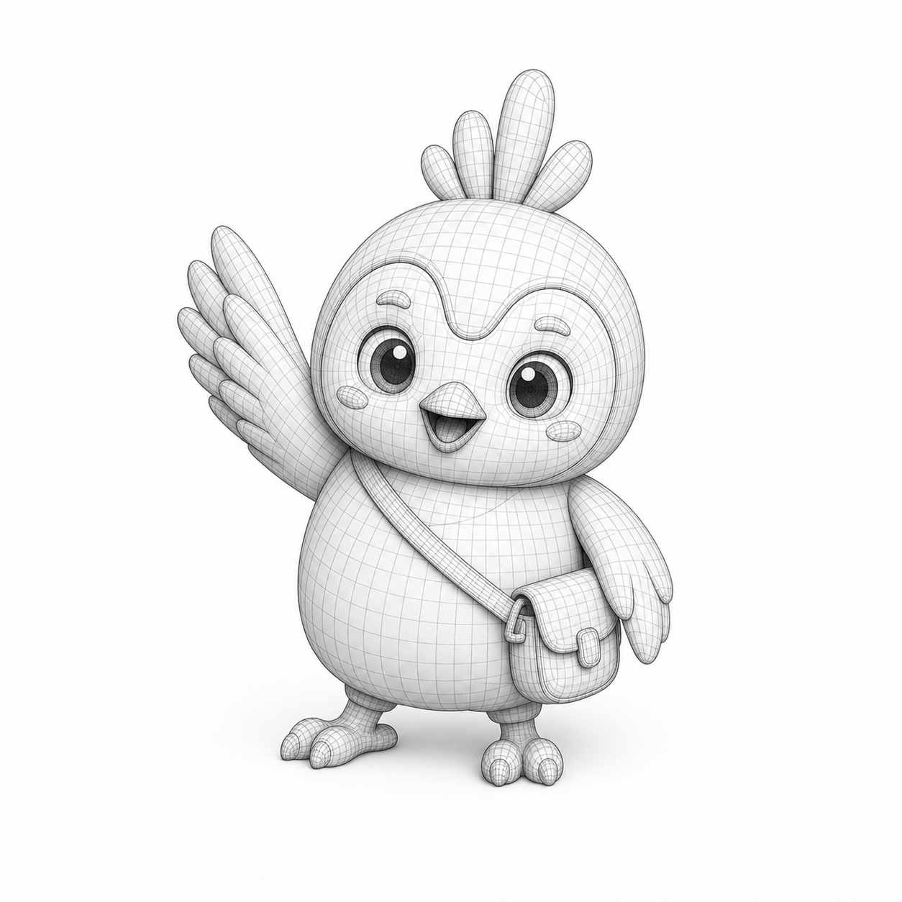
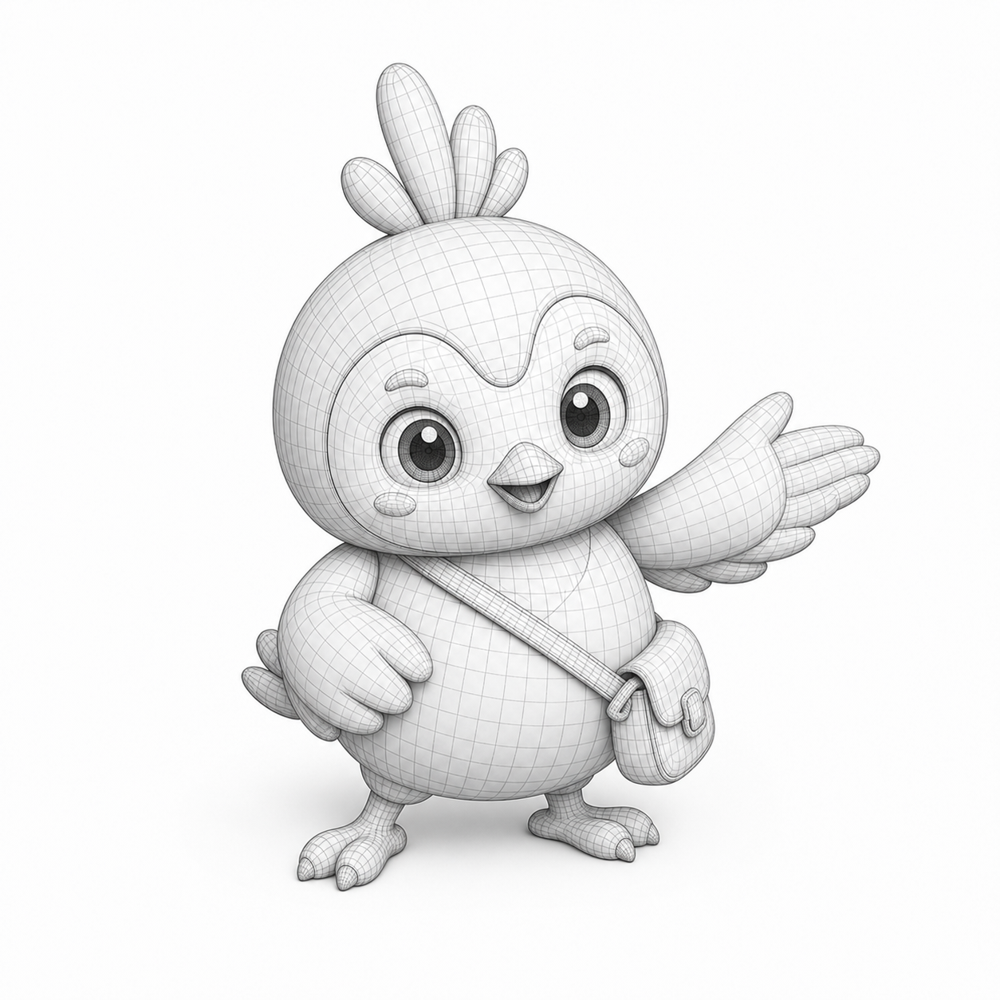
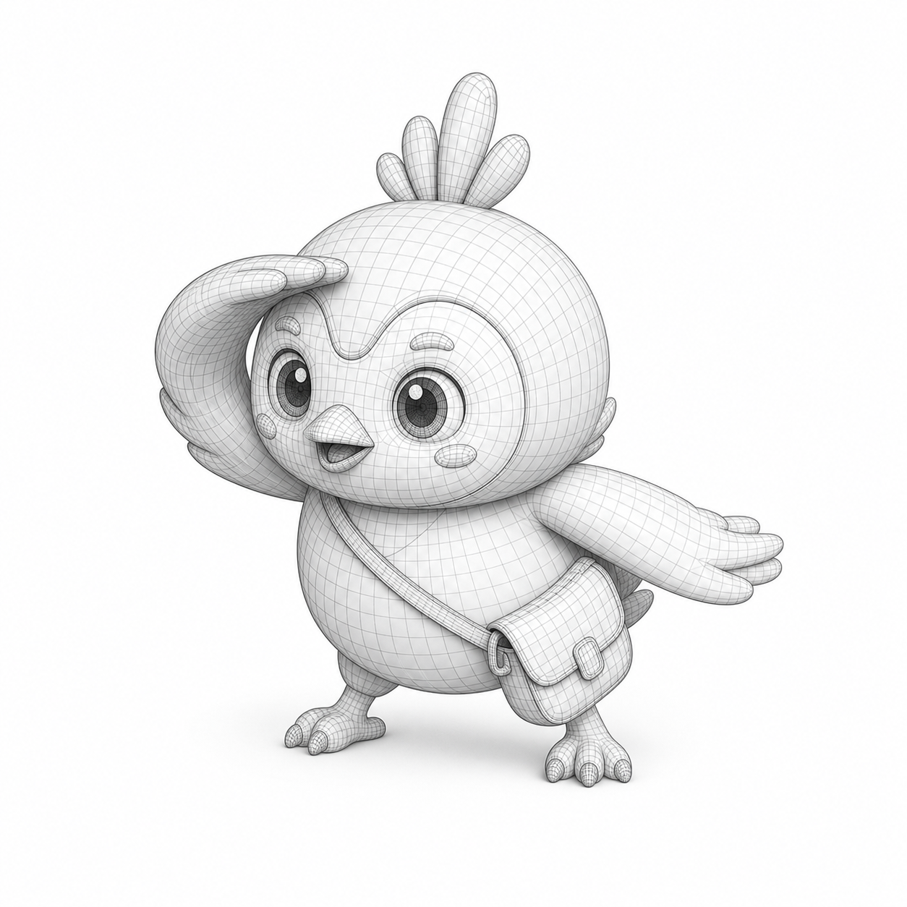
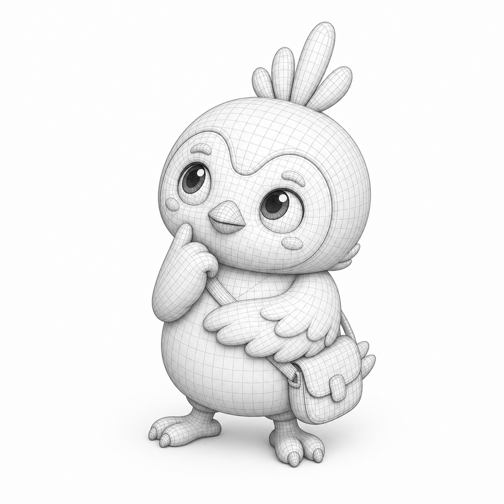
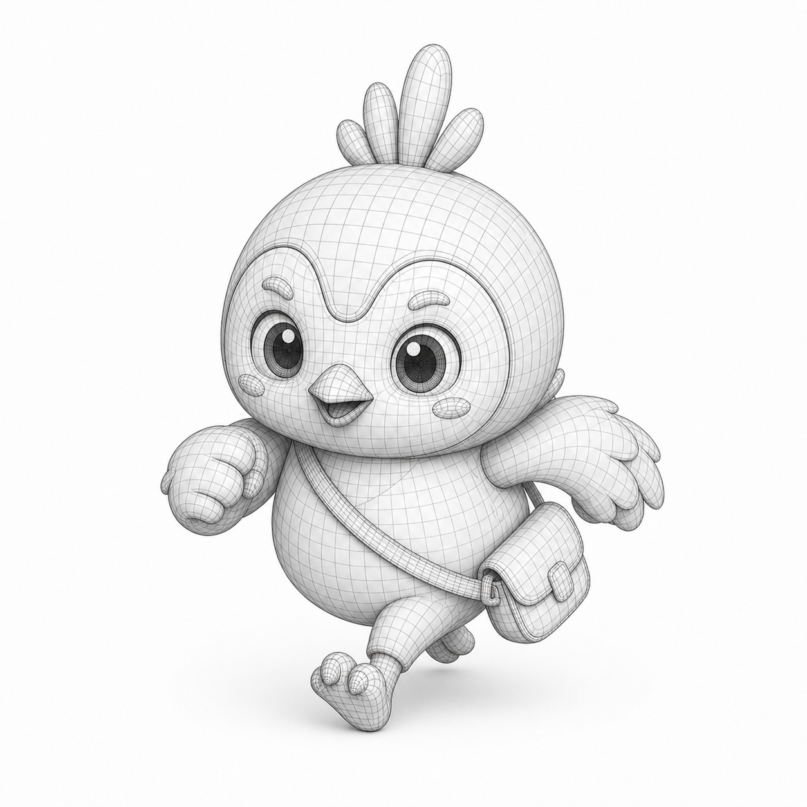
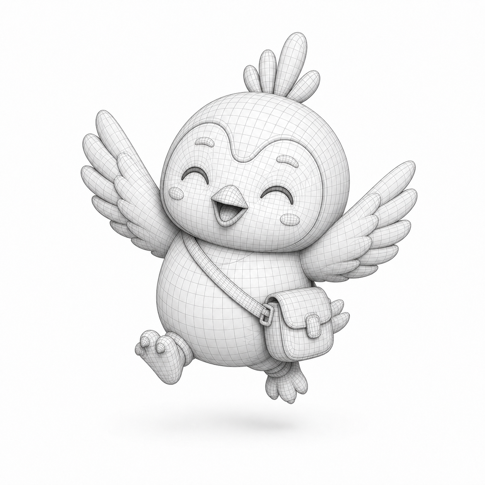
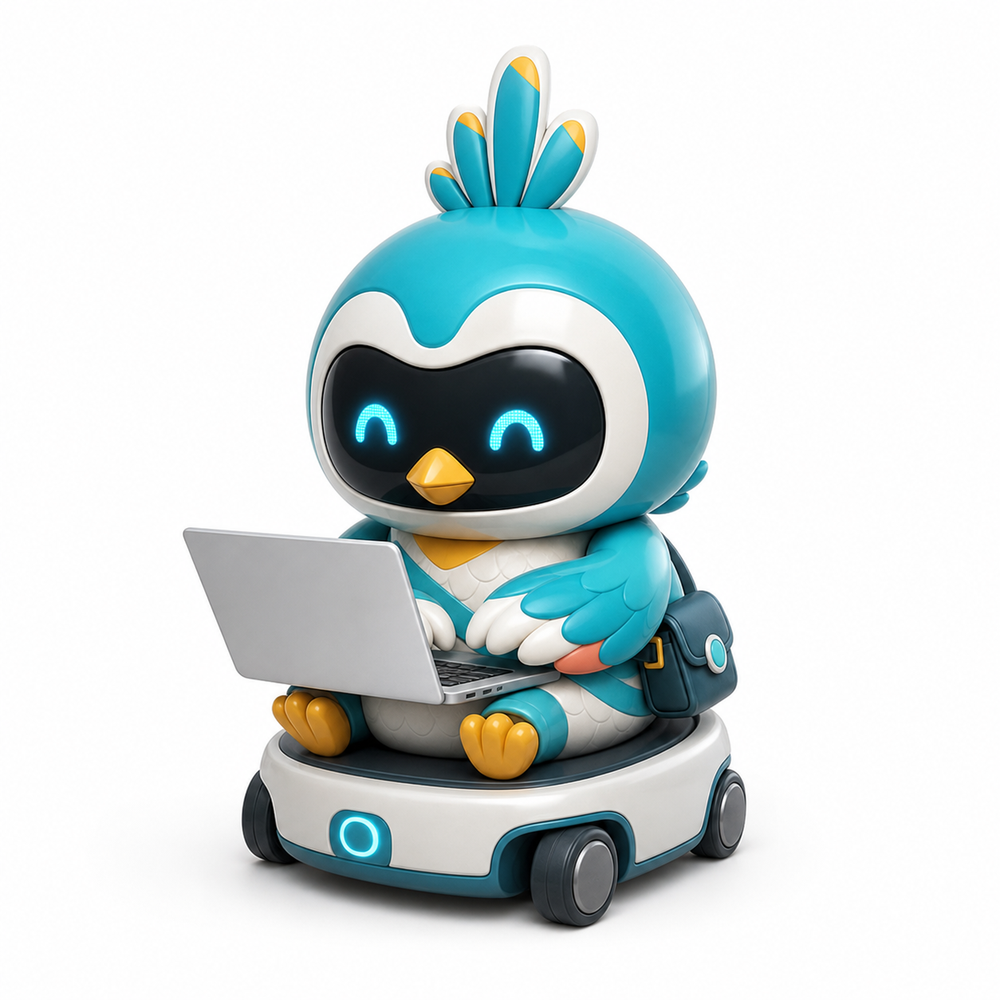

# AIDCP Mascot Visual Action Library

This directory contains optional mascot concept assets for future page work. The
assets are not wired into the Electron renderer and do not replace the current
runtime images under `src/electron/renderer/assets/`.

## Quick selection

All files are square `1254 x 1254` PNGs with a white studio background. Treat
them as source artwork: choose an asset first, then optimize or derive the final
page-specific format in the implementation change.

| Preview | Asset | Intended meaning | Good page uses |
| --- | --- | --- | --- |
|  | [`wireframe-base-seated.png`](./assets/wireframe-base-seated.png) | Calm, neutral mascot introduction | Brand story, design process, technical overview |
|  | [`wireframe-welcome.png`](./assets/wireframe-welcome.png) | Welcome or first entry | Onboarding, first-run card, friendly empty state |
|  | [`wireframe-guide.png`](./assets/wireframe-guide.png) | Pointing users toward a next step | CTA support, feature tour, navigation hint |
|  | [`wireframe-observe.png`](./assets/wireframe-observe.png) | Looking for signals or content | Browse, discover, monitor, search explanation |
|  | [`wireframe-think.png`](./assets/wireframe-think.png) | Planning or evaluating | Analysis, strategy, draft preparation |
|  | [`wireframe-execute.png`](./assets/wireframe-execute.png) | Work is actively progressing | In-progress state, task execution, transition |
|  | [`wireframe-celebrate.png`](./assets/wireframe-celebrate.png) | Confirmed completion | Success page, completed onboarding, delivered result |
|  | [`smart-assistant-laptop.png`](./assets/smart-assistant-laptop.png) | A capable AI assistant is working | Product hero, AI capability section, generation/workspace empty state |

## Visual families

### Wireframe action family

The wireframe family presents the existing mascot as a monochrome 3D model:
light-gray clay surfaces, fine quad-topology lines, white background, restrained
studio lighting, and a consistent front three-quarter camera. It is strongest
when a page needs to communicate design, mechanism, process, or technical craft.

Keep the following identity anchors when extending the family:

- oversized rounded bird head and compact body;
- feather crest, bird beak, white face-patch shape, layered wings, and short
  three-toed feet;
- cross-body utility pouch;
- friendly proportions and readable full-body silhouette;
- monochrome topology treatment with no cat ears, headphones, robot faceplate,
  cursor icon, text, or extra props.

### Glossy smart-assistant family

`smart-assistant-laptop.png` is a separate page-illustration direction. It uses
a polished product-render language: satin white and AIDCP teal shell, glossy
dark digital face panel, cyan eyes, silver laptop, and a compact mobility base.
It borrows the reference's capable desktop-assistant mood without adopting a
cat identity.

The bird crest, physical beak, wings, feet, face-patch contour, and utility pouch
remain the identity anchors. Future variants should not add cat ears, cat paws,
headphones, or a generic off-the-shelf robot head.

## Semantic use rules

The pose communicates state, but it is not proof that a system event happened.
Keep these boundaries explicit in product pages:

- `wireframe-observe.png` means browsing or looking for signals; it does not mean
  that a useful target was found.
- `wireframe-think.png` means planning or evaluating; it does not mean a task was
  dispatched.
- `wireframe-execute.png` and `smart-assistant-laptop.png` mean work is in
  progress; they do not mean content was published or accepted by a platform.
- `wireframe-celebrate.png` should appear only after the page has a confirmed
  success state, not merely after authorization or dispatch.

## Implementation guidance

1. Reference these files directly only in design previews or documentation.
2. For production UI, copy the selected asset into the owning runtime asset
   directory with a purpose-specific name; do not overwrite the three existing
   `mascot-*-512.png` files by default.
3. Keep the full silhouette visible with `object-fit: contain`. Avoid circular
   avatar crops because they cut the wings, feet, or pouch.
4. The current PNGs have a white background. Do not assume transparency. Derive
   a transparent or page-colored version only after the target surface and edge
   treatment are known.
5. If the image is decorative, use an empty alt attribute. If it communicates
   state, use alt text that describes the real state rather than the pose alone.
6. Optimize the selected production copy to WebP/AVIF when appropriate; retain
   these PNGs as the reusable source set.

Example CSS:

```css
.mascot-illustration {
  display: block;
  width: min(280px, 42vw);
  height: auto;
  object-fit: contain;
}
```

## Reusable generation anchors

The files were produced with the built-in `imagegen` path on 2026-07-20. The
existing runtime files `mascot-task-execution-512.png`,
`mascot-monitoring-512.png`, and `mascot-celebration-512.png` were used only as
identity references.

Use this shared identity constraint in follow-up prompts:

> Preserve the AIDCP bird mascot's rounded head and body, feather crest, large
> eyes, triangular bird beak, white face-patch contour, layered wings, short
> three-toed feet, cross-body utility pouch, friendly proportions, and full-body
> silhouette. Change only the requested pose or surface treatment.

Wireframe prompt anchor:

> Render the mascot as a monochrome grayscale 3D character-model study on a
> white studio background, with smooth light-gray clay surfaces and fine clean
> quad-topology lines. Use a centered full-body front three-quarter view. Add no
> cat ears, headphones, robot faceplate, text, logo, watermark, or extra props.

Glossy smart-assistant prompt anchor:

> Render the mascot as a polished premium 3D smart assistant on a white studio
> background, using satin white and AIDCP teal surfaces, a dark glass face panel
> with cyan digital eyes, a visible physical golden beak, a silver laptop, and a
> compact rounded mobility base. Preserve the bird identity and add no cat ears,
> headphones, text, logo, watermark, or extra characters.

For a new action, make one focused pose change per generation and repeat the
identity constraints. Do not ask the model to generate a multi-pose contact
sheet when consistency matters; generate each action separately.
